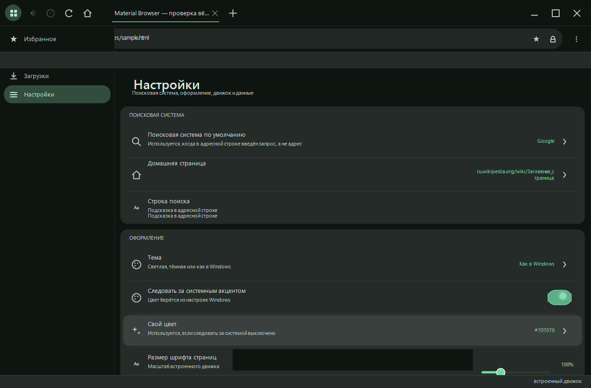
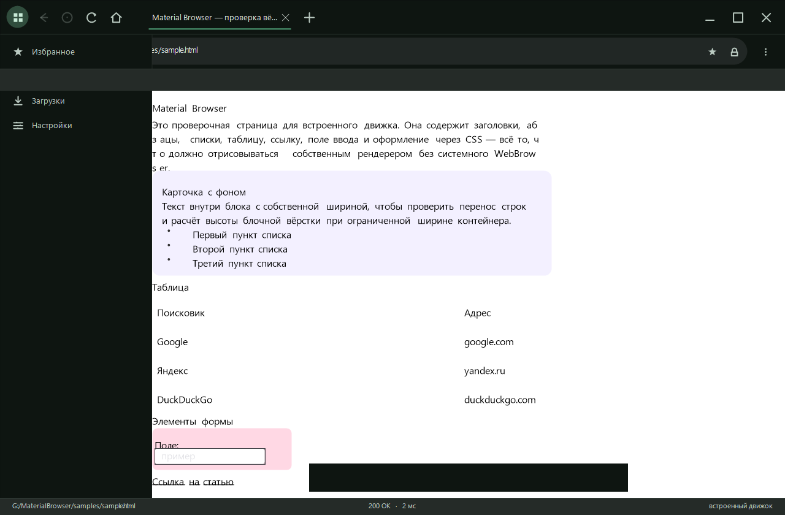
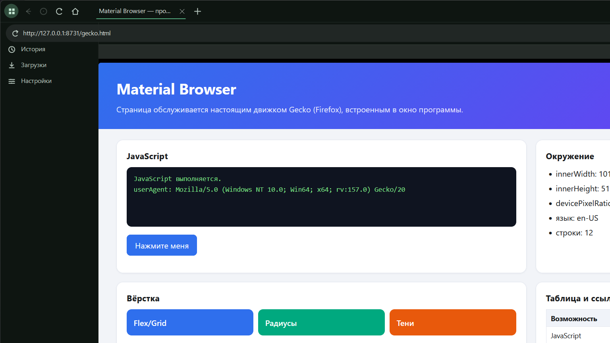
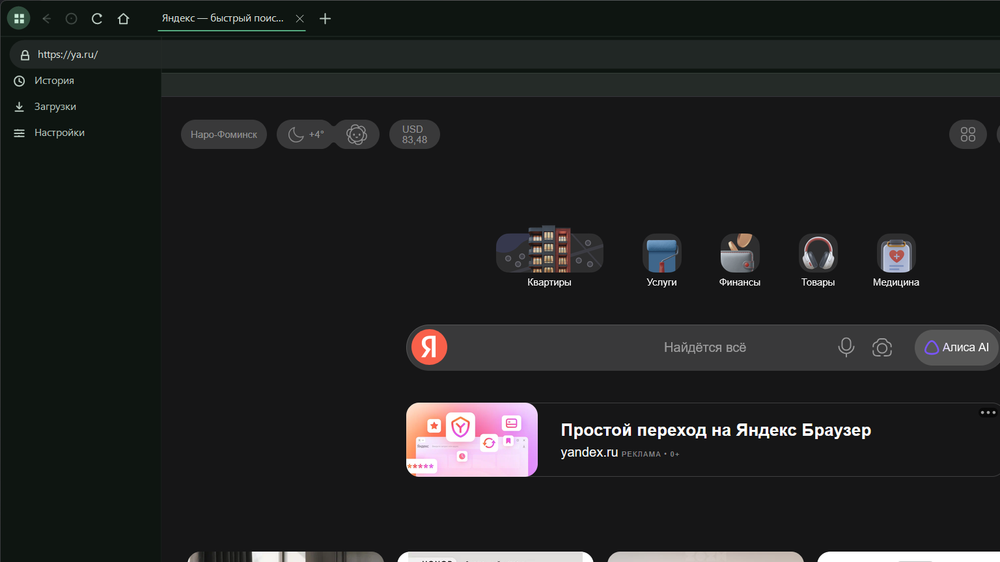
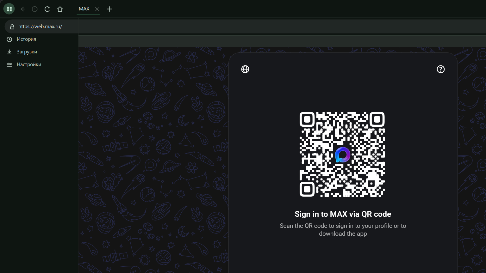

# Material Browser

Браузер для Windows в стиле Material You — в той же визуальной системе, что и Material Settings / Material Files: динамические цвета из темы системы, крупные скруглённые поверхности, тонированные боковые поверхности, плавные переходы и самостоятельно нарисованные элементы управления.

Никаких внешних зависимостей и рантаймов: одна сборка `.NET Framework 4`, весь рендеринг — на `System.Drawing`.





## Что умеет

**Три движка, переключаемых в один клик**

- **Встроенный** — собственный HTTP-клиент, HTML-парсер, CSS-движок и вёрстка. Полноценно работает без сторонних библиотек: рисует блоки, inline-разметку, списки, таблицы, формы, изображения, ссылки и подсветку наведения.
- **Firefox (Gecko)** — настоящий браузерный движок. Приложение само находит установленный Firefox, запускает его в одноразовом профиле и встраивает его окно в панель страницы. Работает JavaScript, CSS, медиа, шрифты — всё, что умеет Gecko.
- **Системный WebBrowser** (IE/Edge ActiveX) — запасной вариант для машин без Gecko.

Выбор: **Настройки → Движок по умолчанию**. Если выбранный движок недоступен, приложение само переключается на встроенный и пишет об этом в уведомлении.

### Требования к движку Firefox

Движок лежит **внутри папки программы** — в `gecko\` (полная копия Mozilla Firefox, ~350 МБ). Никакой установки в системе не нужно: MaterialBrowser не зависит от пользовательского Firefox и не трогает его. Системный Firefox остаётся только запасным вариантом, если папки `gecko\` нет.

Порядок поиска движка:

1. `gecko\firefox.exe` рядом с `MaterialBrowser.exe` — штатный автономный движок, приоритет закреплён в самой программе и не перебивается ничем;
2. `MBR_GECKO` — путь к исполняемому файлу, если он задан (ручная замена движка);
3. распакованный движок в `%LOCALAPPDATA%\MaterialBrowser\gecko\` — если папку рядом с программой нельзя писать;
4. браузер, прописанный в реестре для `firefox.exe`;
5. обычные каталоги установки: Mozilla Firefox, Firefox ESR, Waterfox, LibreFox, Pale Moon, Floorp, SeaMonkey, IceCat, Basilisk, Netfox, Zen Browser.

**Движок внутри одного файла.** По умолчанию EXE весит ~700 КБ и берёт движок из папки `gecko\`. Если собрать с ключом `MBR_EMBED=1`, движок дополнительно упаковывается внутрь EXE (`gecko.zip` → ресурс `MaterialBrowser.gecko.zip`, ~140 МБ), и одного `MaterialBrowser.exe` достаточно: при первом запуске движок распаковывается в `gecko\` сам. Распаковка идёт во временную папку и подменяет конечную только целиком, так что прерванный запуск не оставит половину движка; если папку рядом с программой писать нельзя, используется `%LOCALAPPDATA%`.

> **Замечание о Smart App Control.** Однофайловая сборка (~140 МБ) неподписанная. На проверенной машине Smart App Control заблокировал её при первом запуске (событие `CodeIntegrity` 3077, «did not meet the Enterprise signing level requirements»), а обычную сборку ~700 КБ пропускает сразу. Повторный запуск проходит, и все 139 проверок на встроенном движке зелёные, но полагаться на такое поведение нельзя: на чужой машине блокировка может повториться. Поэтому по умолчанию собирается лёгкий EXE, который запускается всегда. Чтобы однофайловая сборка работала гарантированно, её нужно подписать сертификатом — программа системные настройки безопасности не меняет.

Архив `gecko.zip` собирается один раз: `tools\PackEngine.exe gecko gecko.zip` (пропускает `install.log` и `maintenanceservice*.exe`).

Автономность обеспечивается ещё и тем, что движок всегда запускается с одноразовым профилем, ключами `-no-remote -new-instance`, а его профиль отключает обновления, телеметрию, регистрацию браузера по умолчанию и создание ярлыков. Личный Firefox пользователя не запускается, не изменяется и не закрывается: при выходе завершаются только процессы, чья командная строка содержит наш временный профиль.

### Как устроен движок Firefox

Никаких внешних библиотек и разборщиков — четыре небольших класса:

1. Поиск движка: `gecko\` рядом с программой, `MBR_GECKO`, распаковка встроенного движка, реестр, затем обычные каталоги установки.
2. Запуск в одноразовом профиле (`%TEMP%\MaterialBrowser-<порт>`) с флагом `--remote-debugging-port`; `user.js` отключает стартовые страницы и телеметрию, `userChrome.css` прячет собственную панель Firefox — остаётся только содержимое страницы.
3. Управление — через **WebDriver BiDi** по WebSocket (`ws://127.0.0.1:<порт>/session`): `session.new`, `browsingContext.navigate`, `reload`, `script.evaluate`, события `navigationStarted` / `load`. Свой JSON-разборщик и свой WebSocket-клиент — в `GeckoJson.cs` и `GeckoSocket.cs`.
4. Окно браузера переподчиняется в панель вкладки через `SetParent` + `WS_CHILD` и подгоняется под неё. Один процесс на всё приложение: активная вкладка забирает окно себе, остальные отпускают его.



Проверено на реальных сайтах: **ya.ru** — поиск, погода, быстрые ссылки, все скрипты; **web.max.ru** — тяжёлое SPA с векторной графикой и модальными окнами.





Особенности и ограничения:

- **Назад/вперёд** ведёт сам MaterialBrowser (свой список вкладки), потому что часть сборок Firefox не отдаёт историю через BiDi.
- **Окна-всплывашки** (`window.open`, `target="_blank"`) не перехватываются: сайт вправе открыть окно сам, лишнее окно закрывается, а его адрес подхватывается текущей вкладкой.
- **Диалоги сайта** (`alert`, `confirm`, `beforeunload`) отвечаются автоматически — иначе авторинные сайты вроде MAX висели бы на загрузке.
- **Минимальный размер окна.** Firefox уменьшается до размера панели свободно; отдельные сборки (например, Zen) не дают окну стать меньше примерно 1214×727.
- Профиль браузера удаляется при выходе; завершаются только процессы, запущенные из него (по командной строке), — личный Firefox приложение не трогает.

**Поисковая система — настраивается**

- **Настройки → Поисковая система** открывает меню из восьми движков: Google, Яндекс, Bing, DuckDuckGo, Brave, Mail.ru, Ecosia, Startpage.
- Там же — домашняя страница и строка поиска: видно, какой запрос уйдёт в выбранный движок.
- Строка поиска меняется из меню «⋮» над адресной строкой без захода в настройки.
- Умная адресная строка сама различает адрес и запрос: `example.com` откроется как сайт, `что такое html` уйдёт в поиск. Подсказки строятся по истории и закладкам, а вOmni-строке есть отдельный пикер движка.

**Закладки, история, загрузки**

- Звёздочка в адресной строке, панель закладок под панелью инструментов, боковая панель со списком закладок.
- История с посещёнными страницами, поиском по списку и очисткой.
- Менеджер загрузок с прогрессом, скоростью, открытием папки и удалением.

**Оформление**

- Светлая / тёмная / как в системе, плюс акцент из палитры Material You.
- Собственный масштаб шрифта страниц, загрузка картинок, показ битых изображений, лимит картинок на страницу, восстановление вкладок.
- Боковая панель и панель закладок включаются и выключаются.

## Сборка

Нужен только .NET Framework 4 (на Windows он уже есть). Компилятор берётся из состава framework:

```bash
cd G:/MaterialBrowser
"C:/Windows/Microsoft.NET/Framework64/v4.0.30319/csc.exe" @build.rsp
```

или `build.bat`. Исходники намеренно написаны на C# 5 — более новый синтаксис компилятор framework не понимает.

Иконка пересобирается отдельно:

```bash
cd tools && "C:/Windows/Microsoft.NET/Framework64/v4.0.30319/csc.exe" @make-icon.rsp
./makeicon.exe ../MaterialBrowser.ico icon-preview.png
```

## Проверки

```bash
./MaterialBrowser.exe --apitest .    # 134 проверок: парсер, CSS, вёрстка, хранилище, рендеринг, движок Firefox
./MaterialBrowser.exe --selftest out # снимки экранов + карта раскладки в out/
./MaterialBrowser.exe --live settings|bookmarks|history|downloads [url]
```

`--selftest` рисует окно в четырёх состояниях и сохраняет PNG рядом с картой раскладки элементов (`layout.txt`). `--live` открывает окно в выбранном состоянии и оставляет его на экране — удобно для снимка настоящего окна, а не `DrawToBitmap`.

Переменные окружения: `MBR_TRACE=<путь к файлу>` — трассировка, `MSM_SCHEME=light|dark` — принудительная схема, `MBR_SAMPLE` — страница для `--selftest`, `MBR_NOBACKDROP=1` — без Mica/Acrylic, `MBR_ENGINE=0|1|2` — принудительный движок (2 — Firefox), `MBR_GECKO=<путь к firefox.exe>` — свой движок.

Проверить движок Firefox на живой странице со скриншотом окна:

```bash
powershell -ExecutionPolicy Bypass -File tools/LiveShot.ps1 -Url "https://example.com" -Out shots/live.png
powershell -ExecutionPolicy Bypass -File tools/ColdStartShot.ps1   # запуск без аргументов, как у пользователя
```

Готовая страница для проверки вёрстки лежит в `samples/sample.html`:

```bash
./MaterialBrowser.exe --live home "file:///G:/MaterialBrowser/samples/sample.html"
```

## Данные

Всё лежит в `%LOCALAPPDATA%\MaterialBrowser`:

| Файл | Содержимое |
|---|---|
| `bookmarks.txt` | закладки |
| `history.txt` | история посещений |
| `downloads.txt` | загрузки |
| `session.txt` | вкладки для восстановления |
| `cache\` | кэш изображений |
| `error.log` | необработанные исключения (если что-то пошло не так) |

Настройки — в реестре, `HKCU\SOFTWARE\MaterialBrowser`.

## Устройство кода

| Файл | Назначение |
|---|---|
| `MaterialYou.cs` | палитра из акцентных цветов Windows, генерация схем |
| `Theme.cs` | реестр, настройки, DPI-масштаб |
| `Icons.cs` | весь набор иконок, нарисованный кривыми |
| `Controls.cs` | кнопки, переключатели, слайдеры, волна нажатия |
| `TextField.cs` | поле ввода: `TextBox` не умеет прозрачный фон, поэтому свой |
| `Widgets.cs` | скролл-контейнеры, ленты вкладок, чипы |
| `Menu.cs`, `Dialogs.cs` | меню и модальные окна в стиле M3 |
| `Data.cs` | закладки, история, загрузки, атомарная запись |
| `Engines.cs` | поисковые системы, разбор адреса |
| `Http.cs` | загрузка документов, TLS 1.2, кодировки, загрузка файлов |
| `Html.cs` | токенизатор HTML: void-элементы, raw-text, неявные закрытия, entity |
| `Css.cs` | разбор таблиц стилей, специфичность, `!important`, цвета и длины |
| `Layout.cs` | блочная вёрстка: блоки, inline-строки, списки, таблицы, leaf-элементы |
| `Page.cs`, `PageView.cs` | модель страницы и её отрисовка, ховер, отправка форм |
| `SystemView.cs` | хост системного WebBrowser с откатом на встроенный движок |
| `GeckoJson.cs` | минимальный разборщик и сериализатор JSON для BiDi |
| `GeckoSocket.cs` | WebSocket-клиент (RFC 6455) и сессия WebDriver BiDi |
| `Gecko.cs` | поиск движка, запуск, одноразовый профиль, переподчинение окна, диалоги сайтов, остановка |
| `GeckoView.cs` | панель движка Firefox с тем же набором событий, что и `SystemView` |
| `Chrome.cs` | адресная строка, панель закладок, боковая панель, полоса загрузки |
| `Pages.cs` | строки настроек: переключатель, слайдер, выбор, действие |
| `MainForm.cs` | окно, вкладки, маршрутизация, меню, тема |
| `Program.cs` | точка входа, `--selftest`, `--live` |
| `gecko\` | автономный движок: полная копия Mozilla Firefox, ставится не нужна |
| `gecko.zip` | тот же движок упакован для `MBR_EMBED=1` — сборка в один файл |
| `MaterialBrowser.ico` | иконка программы, 9 размеров от 16 до 256, рисуется кодом |
| `tools\IcoGen.cs` | генератор иконки |
| `tools\PackEngine.cs` | упаковщик `gecko\` в `gecko.zip` |
| `tools\UnpackCheck.cs` | проверка распаковки встроенного движка теми же исходниками |
| `ApiTest.cs` | 140 автономных проверок |
| `Install.cs` | установщик и деинсталятор в одном `Setup.exe` |
| `GeckoDownloads.cs` | файлы, сохранённые движком Firefox, попадают в загрузки |